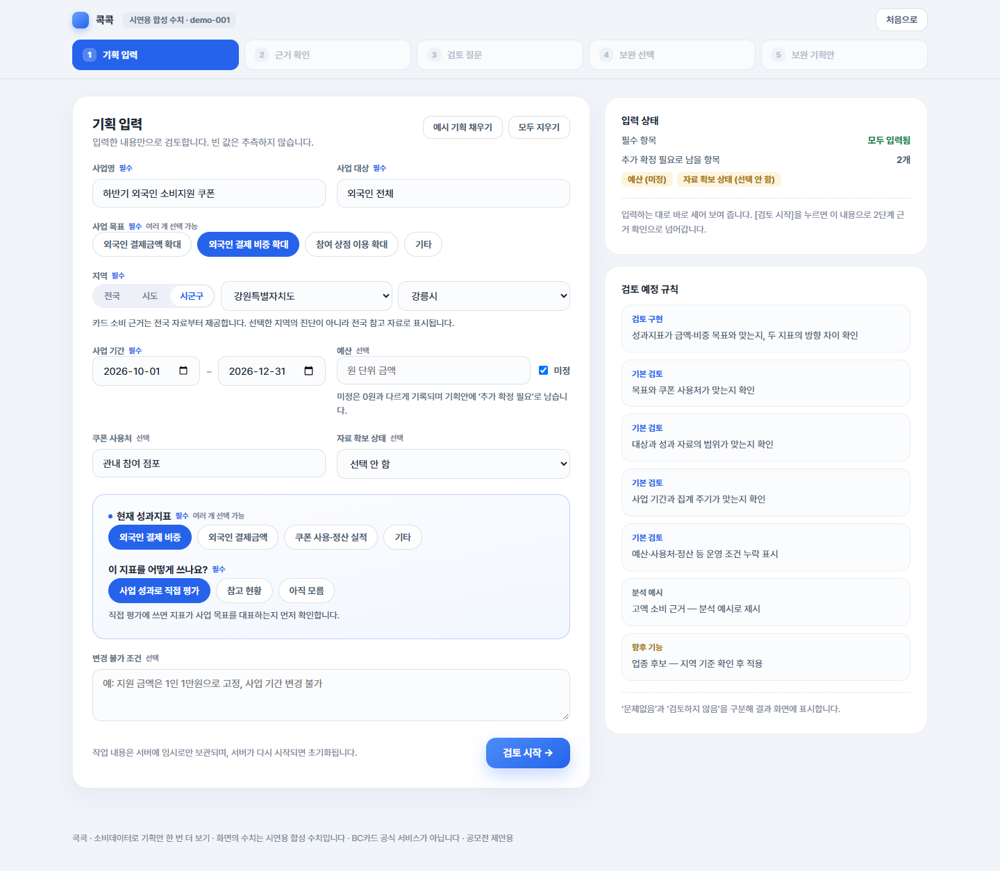
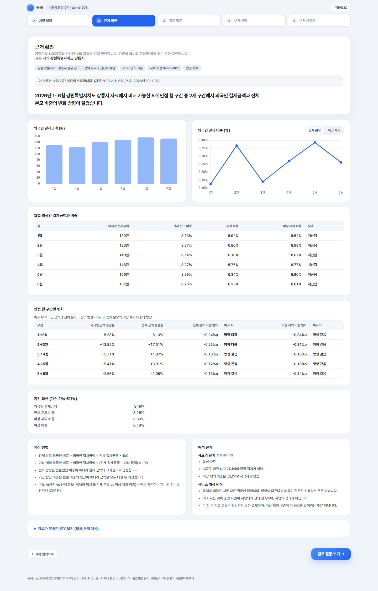
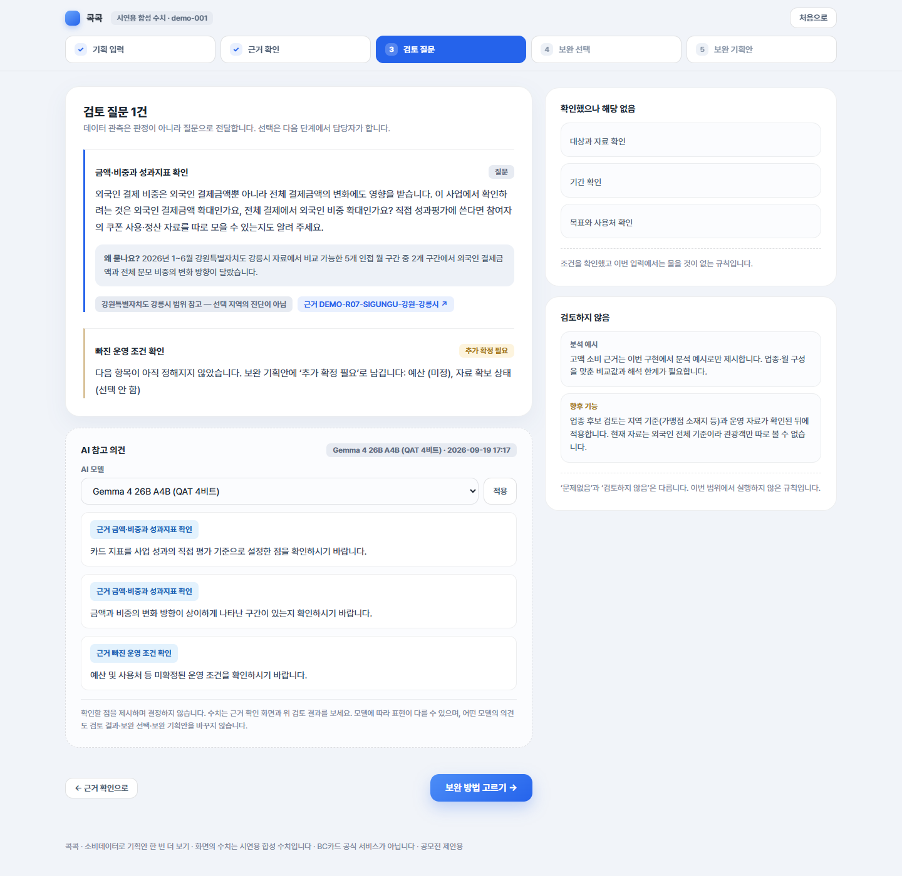
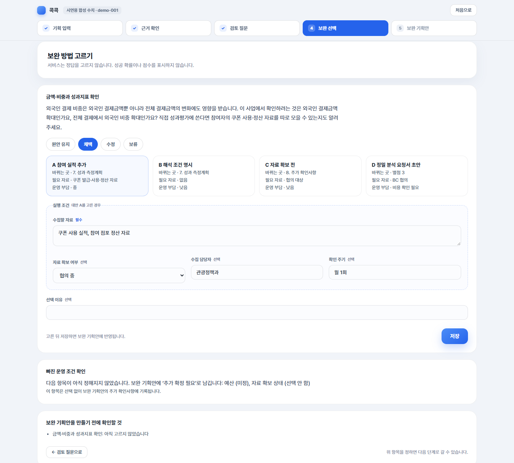
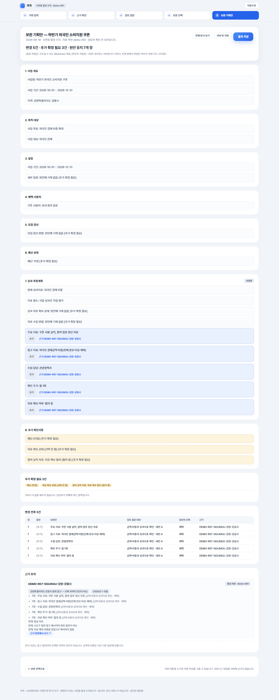
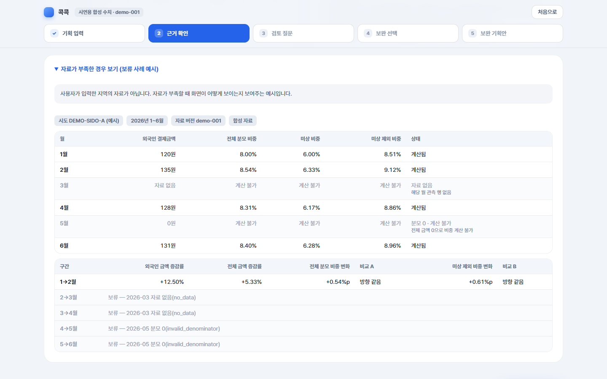

# 콕콕 사용법

> 소비데이터로 기획안 한 번 더 보기

> 기준: 2026-09-21 코드. 화면 캡처는 2026-09-19의 **시연용 합성 수치** 화면이며 실제 카드 분석 결과가 아닙니다. 9/20 이후 추가된 지역 프로필·질문·문서 화면은 캡처 갱신 대기입니다.
> 캡처를 다시 만들 때: `uv run python scripts/capture_screenshots.py` ([screenshots/README.md](screenshots/README.md))

## 1. 이 서비스로 하는 일

지자체·행사 담당자가 사업 기획안을 입력하면, 카드 소비데이터 근거를 보여 주고 확인할 질문을 던집니다. 담당자가 보완 방법을 고르면 그 선택을 반영한 **보완 기획안 전체 문서**를 만들어 저장할 수 있습니다.

서비스는 예측하거나 판정하지 않습니다. 관측은 질문으로 전달하고, 결정은 담당자가 합니다.

```
1 기획 입력 → 2 근거 확인 → 3 검토 질문 → 4 보완 선택 → 5 보완 기획안
```

## 2. 준비

| 필요한 것 | 설명 |
|---|---|
| Python 3.12, [uv](https://docs.astral.sh/uv/) | 저장소에서 `uv sync`로 의존성 설치 |
| 인터넷 연결 | 글꼴(Pretendard)과 차트(Chart.js)를 CDN에서 불러옵니다. 연결이 없으면 차트 자리에 "차트를 표시하지 못했습니다" 안내가 나오고, 같은 수치는 표에서 볼 수 있습니다 |
| (선택) Google AI Studio API 키 | 3단계 **AI 참고 의견**을 쓸 때만 필요합니다. 없어도 1~5단계는 모두 동작합니다 |

AI 참고 의견을 쓰려면 Google AI Studio에서 받은 키를 현재 PowerShell 창의 환경변수에 넣습니다. 키를 저장소나 채팅에 붙여 넣지 마세요.

```powershell
$env:GEMINI_API_KEY="발급받은 키"
```

- `run_deploy.ps1`이 Google AI 모델 목록과 기본 모델을 자동으로 설정합니다.
- 배포 서비스에서는 `GEMINI_API_KEY`를 Secret 환경변수로 등록합니다.
- AI 응답을 기다리는 최대 시간은 기본 45초입니다(`PSM_LLM_TIMEOUT_S`로 바꿈).

### Vercel에서 실행할 때

Vercel 배포본은 작업 상태를 Upstash Redis에 저장합니다. Vercel 프로젝트에 Upstash Redis를 연결하고
`PSM_SESSION_BACKEND=redis`, `PSM_LLM_PROVIDER=google_ai`, `GEMINI_API_KEY`를 Preview와 Production
환경변수로 등록합니다. 자세한 순서는 [Vercel 배포 안내](vercel_deployment.md)를 따릅니다.

## 3. 실행

```powershell
.\run_deploy.ps1             # 공개 합성 자료 + Google AI
.\run_deploy.ps1 -NoLlm      # 공개 합성 자료, AI 참고 의견 없음
```

브라우저에서 `http://127.0.0.1:8000`을 엽니다. 실제 지명을 고르면 화면 위쪽에 **"시연용 합성 수치 · demo-hierarchy-002"**, 별도 `공개 시연 지역` A~L을 고르면 **"시연용 합성 수치 · demo-2.1-003"**이 표시됩니다. 두 자료의 전국값과 운영 기준은 섞지 않습니다. 실제 지명 선택지는 2026년 6월 기준이며, 인천의 7월 개편 전 구역을 포함합니다. 아래의 과거 화면 캡처는 이전 데이터 버전의 예시로, 현재 수치와 다를 수 있습니다.

## 4. 따라 하기

### 1단계 기획 입력



1. **[예시 기획 채우기]**를 누르면 첫 시험 사례가 채워집니다. 직접 입력해도 됩니다.
2. 필수 항목은 사업명·**사업 유형**·목표·대상·지역·기간·현재 성과지표·지표 용도입니다. 사업 유형은 쿠폰·지역화폐 / 외국인·관광 / 축제·행사 / 연령 대상 중에서 고릅니다. 서비스가 유형을 추측하지 않습니다.
3. 사용처 업종·대상 연령 선택지는 근거 파일의 목록에서 옵니다. 목록이 없는 근거 파일이면 이 입력칸도 나오지 않습니다. 축제·행사에서는 목표 방문객 수를 비우면 추가 확정 필요로 남습니다.
4. 예산·쿠폰 사용처·자료 확보 상태를 비우면 보완 기획안에 **[추가 확정 필요]**로 남고, 오른쪽 **입력 상태** 칸에 바로 표시됩니다. 서비스가 값을 짐작해 채우지 않습니다.
5. 오른쪽 **입력 상태**를 확인하고 **[검토 시작 →]**을 누릅니다.

> 주소창에 `http://127.0.0.1:8000`만 치면 **소개 화면(랜딩)**이 나옵니다. [예시 기획으로 체험]을 누르면 1단계로 넘어갑니다.

### 2단계 근거 확인



- 맨 위 **지역 소비 프로필**은 고른 지역의 업종·연령 구성, 월별 소비 흐름, 외국인·미상 비중, 전국에서의 자리와 해석 한계를 보여 줍니다. 프로필은 다른 지역 값으로 넓히지 않습니다. 자료가 없거나 준비되지 않았으면 그 이유만 표시합니다.
- 그 아래 관측 요약은 비교 가능한 인접 월 구간 중 외국인 결제금액과 전체 분모 비중의 **변화 방향이 달랐던 구간 수**를 보여 줍니다.
- 범위 표시: 서비스는 **시군구 → 시도 → 전국** 순으로 **쓸 수 있는 가장 좁은 범위**를 씁니다. 한 칸 넓혔으면 그 이유(자료 없음 / 사용 불가 / 표본 부족)를 한 줄로 알려 줍니다.
  - 예: "선택한 서울특별시 종로구의 자료는 표본이 부족해(6개월 중 계산 가능한 달이 3개월…) 서울특별시 자료를 보여 줍니다."
  - 어느 범위를 쓰든 **"선택 지역의 진단이 아님"**을 함께 적습니다.
- 자료 기간이 사업 기간과 겹치지 않으면 **"이 자료는 사업 기간 이전의 흐름입니다"**가 한 줄 붙습니다. 수치는 그대로 보여 줍니다.
- 지역 자료의 계산 가능한 달이 너무 적으면 차트와 요약을 접고 **계산하지 못한 달**만 보여 줍니다.
- 차트 오른쪽 위 **[전체 분모] / [미상 제외]**로 비중의 분모를 바꿔 볼 수 있습니다. 미상 제외 비중이 더 정확한 값이라는 뜻은 아닙니다.
- **월별 표**와 **인접 월 구간별 변화**에 모든 수치가 있습니다. 비교 A는 외국인 금액과 전체 분모 비중의 방향, 비교 B는 전체 분모와 미상 제외 비중의 방향입니다.
- **해석 한계**는 두 묶음입니다. "자료의 한계(분석 담당 작성)"는 근거 파일에 적힌 문장, "서비스 해석 원칙"은 서비스가 항상 보여 주는 원칙입니다.

### 3단계 검토 질문



- 사업 유형에 맞는 질문만 실행합니다. 유형을 고르지 않은 기획은 서비스가 임의로 숨기지 않고 모든 질문을 실행합니다.
- **질문** 카드는 담당자가 4단계에서 답해야 하는 항목입니다. 사용처 업종, 업종 안의 대상 연령 구성, 성과지표의 자료 범위, 사업 시기, 외국인 대상 기반, 목표 방문객 규모와 수용 여건 등을 확인합니다.
- **추가 확정 필요** 카드(R05)는 선택 없이 보완 기획안 8장에 기록됩니다.
- 오른쪽 상태는 **확인했으나 해당 없음 / 사업 유형이 달라 확인하지 않음 / 검토하지 않음**으로 나눕니다. 조건을 확인했는지, 유형 때문에 실행하지 않았는지, 아직 구현 범위가 아닌지가 서로 다른 뜻이기 때문입니다.
- 규칙마다 조건·질문·대안은 [review_rules.md](review_rules.md)에 있습니다.

### 4단계 보완 선택



1. 질문마다 **원안 유지 / 채택 / 수정 / 보류** 중 하나를 고릅니다. 채택·수정이면 대안(A~D)도 고릅니다.
2. 참여 실적·성과지표·연령 확인·수용 여건 자료처럼 실행 조건이 있는 대안은 **수집할 자료**(필수)와 자료 확보 여부·수집 담당자·확인 주기(선택)를 적습니다. 같은 자료를 묻는 질문끼리는 입력을 함께 씁니다.
3. 수정은 대안 문장을 담당자가 고친 문장으로 바꿉니다. 대안 D는 보완 기획안에 **정밀 분석 요청서 초안**을 붙입니다(계약·제공이 확정됐다는 뜻이 아닙니다).
4. **[저장]**을 누릅니다. 고른 것을 되돌리려면 **[선택 취소]**를 누릅니다. 모든 질문에 답하면 **[보완 기획안 만들기 →]**가 나타납니다.

### 5단계 보완 기획안



- 1~8장 전체 문서입니다. 파란 줄은 선택으로 **추가·변경된 문장**이고 `변경 001` 같은 공개 이름표와 근거 ID가 붙습니다. 내부 규칙 번호는 화면과 저장 문서에 쓰지 않습니다.
- **변경 전후** 표의 같은 변경 이름표로 본문 문장을 찾을 수 있습니다. **근거 추적**에는 고른 지역 소비 프로필 요약이 항상 들어가며, 자료가 미연결이면 다른 지역 값으로 대신하지 않았다는 사유가 남습니다.
- **[전체 문서 보기]**는 저장될 Markdown 원문을, **[정밀 분석 요청서 초안]**은 대안 D를 고른 경우의 요청서를 보여 줍니다.

## 5. 자료가 부족할 때



- 2단계 아래 **"자료가 부족한 경우 보기 (보류 사례 예시)"**를 열면, 자료가 없거나 분모가 0인 달이 있을 때 화면이 어떻게 보이는지 합성 예시로 볼 수 있습니다. 사용자가 입력한 지역의 자료가 아닙니다.
- 자료가 없는 달은 0으로 채우지 않고 "자료 없음", 계산할 수 없는 구간은 "보류 — 사유"로 표시합니다.
- 근거 파일에서 R07 적용 상태가 "검수 남음"·"사용 안 함"이거나 비교할 수 있는 구간이 없으면, R07은 질문 대신 **보류** 카드가 되고 보완 기획안 8장에 보류 사유가 기록됩니다. 보류 카드는 4단계에서 고르지 않아도 됩니다.

## 6. AI 참고 의견과 모델 고르기

AI 참고 의견을 켜 두면(2장 설정) 3단계 아래에 **AI 참고 의견** 칸이 나옵니다.

- **AI 모델** 선택 칸에서 모델을 고르고 **[적용]**을 누릅니다. 현재 API 키에서 사용할 수 없다고 확인된 모델은 비활성화됩니다.
- **[AI 의견 생성]**을 눌러야 콘텐츠 생성을 요청합니다. 화면을 열거나 새로고침하는 것만으로는 생성 토큰을 사용하지 않습니다.
- 의견은 최대 3줄이며, 줄마다 아래에 **어느 검토 질문을 근거로 했는지**가 배지로 붙습니다. 모델에는 금액·비중·순위·인구 같은 수치를 보내지 않고, 규칙 결과와 담당자가 입력한 목표·대상·지표만 보냅니다. 숫자나 한글 수량 표현, 판정 표현이 들어간 줄은 화면에 보이지 않게 걸러집니다.
- **AI 의견은 검토 결과·보완 선택·보완 기획안을 바꾸지 않습니다.** 참고만 합니다. 모델에 따라 표현이 다를 수 있습니다.
- 한 번 받은 의견은 같은 원안·같은 모델이면 다시 부르지 않습니다. 무료 사용 가능량을 넘으면 잠시 뒤 다시 시도합니다.

## 7. 저장

| 버튼 | 결과 |
|---|---|
| **[결과 저장]** | 보완 기획안을 Markdown(`.md`) 파일로 저장합니다. 저장 위치를 고르는 창이 뜨고, 지원하지 않는 브라우저는 내려받기 폴더에 저장합니다. 파일 이름: `보완기획안_{사업명}_{날짜}.md`. 고쳐 쓸 수 있는 원고입니다 |
| **[PDF로 저장]** | 브라우저 인쇄 창을 엽니다. 대상을 "PDF로 저장"으로 고르세요. 화면 전용 요소는 빠지고 표·변경 표시·고지는 남습니다. 그대로 공유하는 사본입니다 |
| **[요청서 저장]** | 정밀 분석 요청서 초안 화면에서 요청서만 따로 저장합니다(`정밀분석요청서_{사업명}_{날짜}.md`) |

서비스는 서버에 파일을 남기지 않습니다.

## 8. 기획이나 근거 자료가 바뀌었을 때

- 1단계에서 원안을 고쳐 다시 **[검토 시작 →]**을 누르면 검토를 다시 실행합니다. 3단계에 "원안이 바뀌어 검토를 다시 실행했습니다" 안내가 나옵니다.
- 바뀐 입력과 관련 있는 선택은 4단계에서 다시 확인 대상으로 표시됩니다. **자료 버전**이 달라지면 값 기반 질문만, **운영 기준 버전**이 달라지면 그 기준값을 쓰는 질문만 다시 확인합니다.
- 내용을 확인하고 다시 **[저장]**하면 풀립니다. 다시 확인하기 전에는 5단계 문서를 만들거나 저장하지 않습니다.
- 변경으로 더 이상 나오지 않는 질문의 선택은 보관되고, 이번 변경으로 보관된 것만 4단계에 안내됩니다. 보관된 선택은 보완 기획안에 반영하지 않습니다.

## 9. 한계와 주의

- **합성 수치:** 저장소와 캡처의 수치는 시연용으로 만든 값입니다. 이 배포 프로젝트에는 내부용 분석 근거 파일과 지역 대응표를 두지 않습니다.
- **지역 자료:** 금액·비중 비교 레코드는 시군구 → 시도 → 전국 사다리로 넓힐 수 있으며 넓힌 이유를 표시합니다. 지역 소비 프로필과 값 기반 질문은 **고른 지역 자료만** 쓰고 다른 지역 값으로 대신하지 않습니다.
- **외부 인구:** 주민등록인구·등록외국인은 관측일과 출처가 카드 자료와 다를 수 있습니다. 규모 참고에만 쓰고 1인당 소비 같은 값을 만들지 않습니다.
- **유사 지역:** 어느 업종 목록으로 비교할지 데이터 담당 확정 전이므로 아직 표시하지 않습니다.
- **작업 상태:** 로컬 실행은 서버 메모리에 보관해 서버를 다시 시작하면 초기화됩니다. Vercel 배포본은 Upstash Redis에 보관하며 마지막 이용 후 기본 24시간 유지됩니다. 위쪽 **[처음으로]**는 지금 작업을 비웁니다.
- **AI 참고 의견:** 참고용이며 같은 입력이어도 문장이 달라질 수 있습니다. 규칙 검토 결과는 같은 입력이면 항상 같습니다.

## 10. 이럴 때는

| 화면 | 확인할 것 |
|---|---|
| 위쪽 표시가 "근거 파일 오류"이고 2단계부터 "분석 근거 파일을 불러오지 못했습니다" | 화면의 안내 문장(레코드 ID·월·필드 이름)을 데이터 담당에게 전달합니다. 문장에는 금액·비중 수치가 없습니다. 파일을 고친 뒤 서버를 다시 시작합니다 |
| "AI 의견을 불러오지 못했습니다" | `GEMINI_API_KEY`가 설정됐는지, Google AI Studio에서 해당 프로젝트의 모델·할당량을 확인합니다. 시간 초과가 반복되면 `PSM_LLM_TIMEOUT_S`를 늘립니다 |
| "이번에는 참고 의견이 없습니다" | 모델의 답이 형식(규칙 번호·수치 없음)에 맞지 않아 모두 걸러진 경우입니다. 다른 모델을 고르거나 다시 열어 봅니다 |
| [보완 기획안 만들기]가 없거나 5단계를 누르면 4단계로 돌아옴 | 4단계 아래 "보완 기획안을 만들기 전에 확인할 것"에 아직 고르지 않았거나 다시 확인이 필요한 질문이 적혀 있습니다 |
| 실행 설정을 바꿨는데 화면이 그대로 | 근거 파일·`.env`는 서버가 시작할 때 읽습니다. 서버를 다시 시작합니다 |
